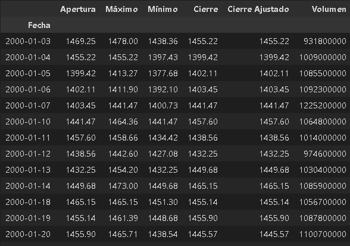
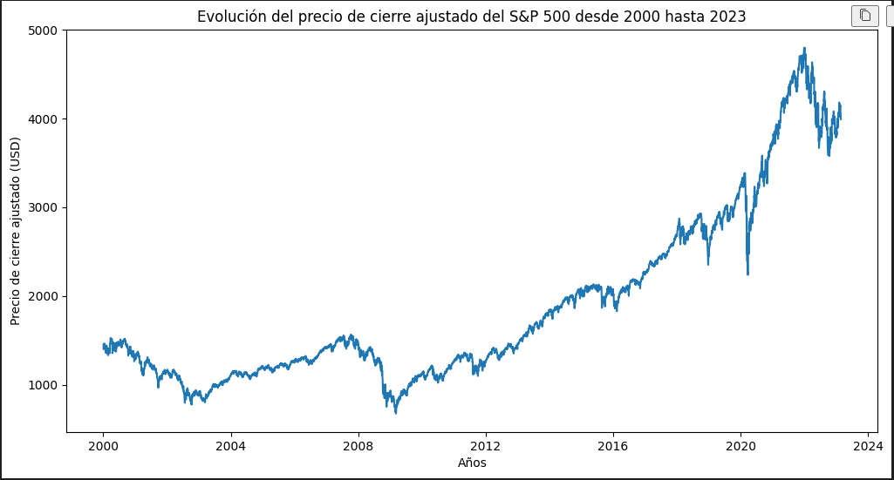
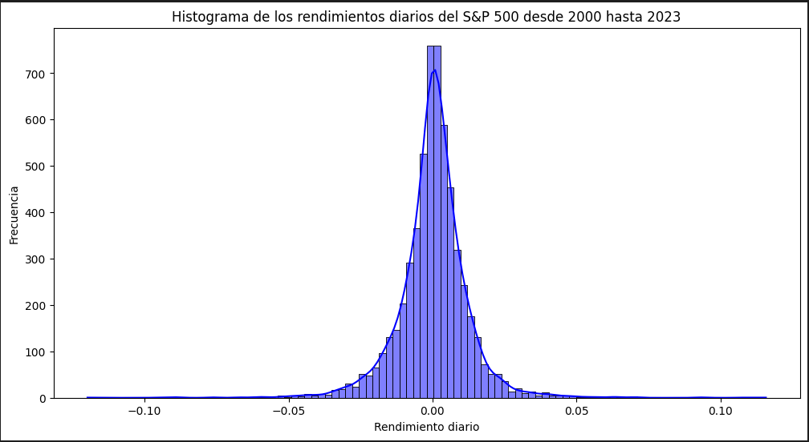

# <h1 align="center">**`Mercado bursátil: Indice S&P500`**</h1>

<p align='center'>

<p>

**Introducción**

El índice S&P 500 es uno de los índices más importantes y representativos del mercado de valores estadounidense. Este índice está compuesto por 500 de las empresas más grandes del mercado y es utilizado como una medida de la salud del mercado de valores de EE. UU.

En este informe, realizaremos un análisis del índice S&P 500 utilizando datos históricos desde el año 2000 hasta la actualidad

**Evolución Historica**

Se obtuVieron los datos del indice SP500 y se normalizaron para mejorar la comprension y lectura de datos



En general, el índice S&P 500 ha tenido un rendimiento muy sólido desde el año 2000. Si observamos el gráfico de la evolución del índice, podemos ver que hubo un declive significativo durante la crisis financiera de 2008, pero desde entonces el índice ha ido aumentando gradualmente. En particular, el período entre 2012 y 2020 fue un período de crecimiento constante para el índice, con algunas correcciones menores en el camino.



Como se puede observar en la gráfica, el índice ha tenido una tendencia alcista en los últimos años, a pesar de los eventos de crisis económicas que han afectado al mundo. Por lo tanto, se puede considerar al S&P 500 como una buena opción de inversión a largo plazo.

**Análisis de volatilidad y distribución**

Para analizar la volatilidad y distribución de los rendimientos diarios del S&P 500 se realizó un histograma de los rendimientos diarios. A través de este histograma, se observa que los rendimientos tienen una distribución aproximadamente normal y que la volatilidad de los rendimientos es moderada.



Para analizar la distribución y detectar valores atípicos en los rendimientos mensuales del S&P 500 se realizó un diagrama de caja. A través de este diagrama de caja, se observa que la mediana se encuentra en un nivel positivo, lo cual es una buena señal para los inversores. Además, se pueden observar algunos valores atípicos, los cuales se detallan a continuación:

```python
Fecha
2002-09-30   -0.110024
2008-10-31   -0.169425
2009-02-28   -0.109931
2011-10-31    0.107723
2020-03-31   -0.125119
2020-04-30    0.126844
2020-11-30    0.107546
>>> class Estructura_Pila(object):
>>>     def __init__(self):
>>>         self.__list = []
>>> 
>>>     # Agregar un elemento a la Pila
>>>     def push(self, item):
>>>         self.__list.append(item)
>>> 
>>>     # Quitar un elemento de la Pila
>>>     def pop(self):
>>>       
```