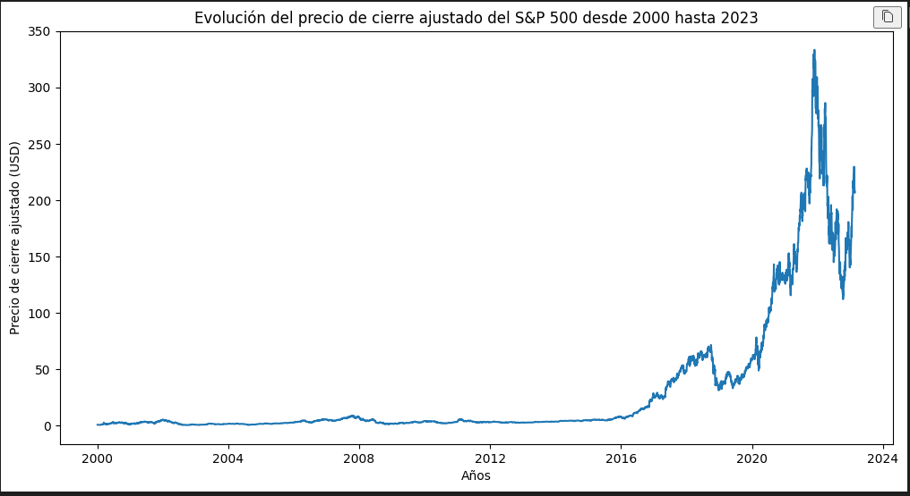
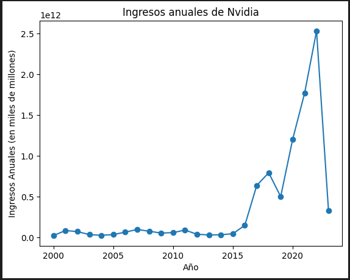
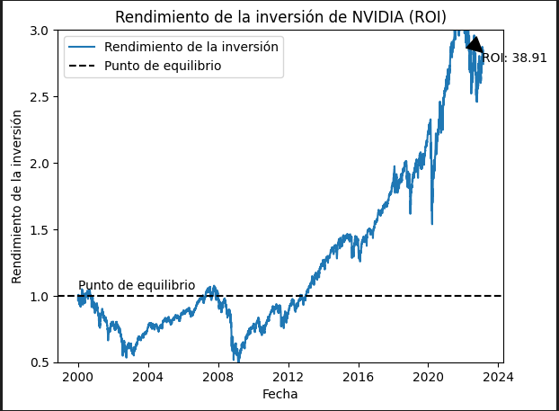
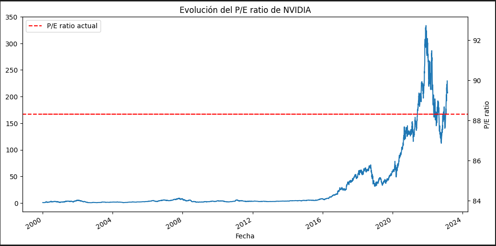
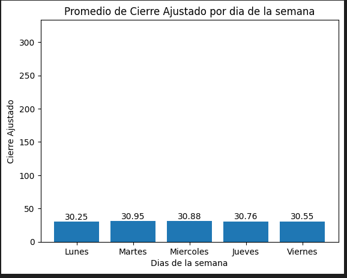

# <h1 align="center">**`Mercado bursátil: Indice S&P500`**</h1>

<p align='center'>

<p>

**Introducción**

El índice S&P 500 es uno de los índices más importantes y representativos del mercado de valores estadounidense. Este índice está compuesto por 500 de las empresas más grandes del mercado y es utilizado como una medida de la salud del mercado de valores de EE. UU.

En este informe, realizaremos un análisis del índice S&P 500 utilizando datos históricos desde el año 2000 hasta la actualidad

**Evolución Historica**

Se obtuVieron los datos del indice SP500 y se normalizaron para mejorar la comprension y lectura de datos


En general, el índice S&P 500 ha tenido un rendimiento muy sólido desde el año 2000. Si observamos el gráfico de la evolución del índice, podemos ver que hubo un declive significativo durante la crisis financiera de 2008, pero desde entonces el índice ha ido aumentando gradualmente. En particular, el período entre 2012 y 2020 fue un período de crecimiento constante para el índice, con algunas correcciones menores en el camino.


Como se puede observar en la gráfica, el índice ha tenido una tendencia alcista en los últimos años, a pesar de los eventos de crisis económicas que han afectado al mundo. Por lo tanto, se puede considerar al S&P 500 como una buena opción de inversión a largo plazo.

**Análisis de volatilidad y distribución**

Para analizar la volatilidad y distribución de los rendimientos diarios del S&P 500 se realizó un histograma de los rendimientos diarios. A través de este histograma, se observa que los rendimientos tienen una distribución aproximadamente normal y que la volatilidad de los rendimientos es moderada.


Para analizar la distribución y detectar valores atípicos en los rendimientos mensuales del S&P 500 se realizó un diagrama de caja. A través de este diagrama de caja, se observa que la mediana se encuentra en un nivel positivo, lo cual es una buena señal para los inversores. Además, se pueden observar algunos valores atípicos, los cuales se detallan a continuación:

```python
Fecha
2002-09-30   -0.110024
2008-10-31   -0.169425
2009-02-28   -0.109931
2011-10-31    0.107723
2020-03-31   -0.125119
2020-04-30    0.126844
2020-11-30    0.107546       
```

**Análisis de rendimiento y riesgo**

Por último, se realizó un análisis de rendimiento y riesgo del S&P 500. La volatilidad anualizada del índice es del 0.2 y el rendimiento anualizado es del 0.07. Por lo tanto, se puede decir que el S&P 500 tiene un perfil de riesgo moderado, con un rendimiento anualizado que supera la inflación.

```python
# Calcular el rendimiento anualizado
retorno_anual = (1 + retorno_diario_verificacion.mean()) ** 252 - 1

# Calcular el perfil de riesgo
perfil_de_riesgo = retorno_anual / volatilidad
```
**¿Entonces que nos dice este analisis?**

El análisis EDA y de rendimiento y riesgo del S&P 500 nos muestra que históricamente ha sido una inversión rentable y relativamente segura en comparación con otros activos financieros. A pesar de las fluctuaciones en el mercado y eventos como la crisis financiera de 2008 y la pandemia de COVID-19, el S&P 500 ha demostrado una tendencia al alza a largo plazo.

Después de analizar el S&P 500 y ver que tiene un alto rendimiento y un equilibrio de riesgo, se decidió invertir en una de las empresas que conforman el índice, NVIDIA

**¿Porque NVIDIA?**

NVIDIA es una empresa líder en tecnología, con un fuerte enfoque en la innovación y el desarrollo de tecnologías avanzadas como la inteligencia artificial, la robótica y los vehículos autónomos. Además, NVIDIA ha experimentado un crecimiento significativo en los últimos años y ha demostrado una capacidad para superar a sus competidores en términos de innovación y desempeño financiero. Por lo tanto, invertir en NVIDIA puede ser una buena opción para aquellos que buscan invertir en una empresa con potencial de crecimiento a largo plazo en una industria en constante evolución.

Por lo tanto, a continuación demostraremos por qué invertir en la empresa NVIDIA es una buena opción. 

En primer lugar, se puede observar en el gráfico del cierre ajustado de la empresa que su precio ha ido en constante aumento desde el 2016, presentando un alto potencial de crecimiento.



**KPI 1: Tasa de crecimiento anual compuesta**



Se puede observar que cuenta con una Tasa de Crecimiento Anual Compuesta del 11%, lo que significa que ha mantenido un crecimiento estable a lo largo del tiempo.

**KPI 2: Retorno diario (ROI)**



Un Retorno Diario del 38%, lo que indica que es una empresa rentable y con un buen desempeño financiero.

**KPI 3: Relación precio-beneficio (P/E Ratio)**



Su P/E Ratio se encuentra en un 88%, lo que sugiere que la empresa tiene un buen desempeño en comparación con sus competidores.

En resumen, al considerar el alto rendimiento y equilibrio de riesgo del S&P 500 y la estabilidad financiera y crecimiento constante de NVIDIA, se puede concluir que invertir en esta empresa es una opción recomendable.

**Cuando invertir**

Este gráfico podría ayudarte a identificar qué días de la semana históricamente han tenido un mejor rendimiento para invertir en Nvidia. En el eje x del gráfico se muestran los días de la semana y en el eje y se muestra el promedio del precio de cierre ajustado para cada día de la semana en el período de tiempo que se haya utilizado para construir el DataFrame.




Si observas que un día en particular ha tenido un promedio de cierre ajustado significativamente más alto que los demás días de la semana, entonces podría ser una buena señal para invertir en Nvidia en ese día de la semana en particular


*Es importante tener en cuenta que cualquier inversión conlleva riesgos y es importante hacer una evaluación cuidadosa antes de tomar cualquier decisión. Si bien el análisis mostró que NVIDIA ha tenido un buen desempeño y puede ser una buena opción de inversión, siempre hay factores externos que pueden afectar el rendimiento de la empresa y del mercado en general. Es importante diversificar su cartera de inversiones y no colocar todos los huevos en una sola canasta.*